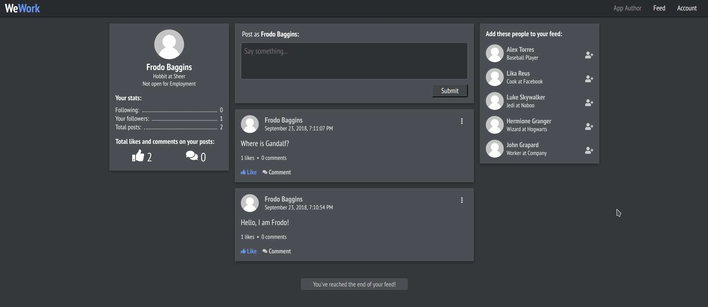

## Web address [](https://travis-ci.org/arkadyt/wework) [](https://coveralls.io/github/arkadyt/wework)

Example app is hosted at [wework.arkadyt.dev](https://wework.arkadyt.dev).

## Description

This is an open-source social networking platform project. It's built on MERN stack (MongoDB, Express, React and Node.js). It combines elements of a few famous social media websites that we all know: Twitter and LinkedIn.

You are more than welcome to fork this project and build something of your own on top of it! Following sections of this readme explain how to launch the application locally, deploy it and run tests.

## Run locally

Clone the repository:
```
git clone git@github.com:arkadyt/wework.git && cd wework
```

Add an .env file to the repo root:
```
PORT=5050
DB_PORT=27950

TZ=America/New_York
NODE_ENV=development

# intentionally not configuring db auth
MONGO_URI='mongodb://db:27017/wework'
SECRET=yoursecretkey123456
```

Run and view the app:
```
# second half sets up db with test data; requires mongorestore binary installed
docker-compose up -d && ./db/dbrestore.sh ./
cd ./client && yarn && yarn start
```

## Run tests

```
# to run client-side tests
cd ./client && yarn test

# to run server-side tests
cd ./server && yarn test
```

## Deploying the application

To deploy the frontend bundle to S3 refer to the `./client/deploy.sh` deployment script.

Deploying the backend application depends on your preferences. The example deployment which I referenced in `Web Address` section of this README file is deployed onto an EC2 instance with a bootstrap script. You can find the script here: https://github.com/arkadyt/dotfiles/blob/master/cloud/api-servers/foss-other/aws-ec2-build.sh. This type of deployment is obviously NOT suitable for production, but gives you an idea of what's needed to successfully deploy this application.

## License

```
The MIT License (MIT)

Copyright © 2020, Arkady Titenko

Permission is hereby granted, free of charge, to any person obtaining a copy of
this software and associated documentation files (the "Software"), to deal in
the Software without restriction, including without limitation the rights to
use, copy, modify, merge, publish, distribute, sublicense, and/or sell copies of
the Software, and to permit persons to whom the Software is furnished to do so,
subject to the following conditions:

The above copyright notice and this permission notice shall be included in all
copies or substantial portions of the Software.

THE SOFTWARE IS PROVIDED "AS IS", WITHOUT WARRANTY OF ANY KIND, EXPRESS OR
IMPLIED, INCLUDING BUT NOT LIMITED TO THE WARRANTIES OF MERCHANTABILITY, FITNESS
FOR A PARTICULAR PURPOSE AND NONINFRINGEMENT. IN NO EVENT SHALL THE AUTHORS OR
COPYRIGHT HOLDERS BE LIABLE FOR ANY CLAIM, DAMAGES OR OTHER LIABILITY, WHETHER
IN AN ACTION OF CONTRACT, TORT OR OTHERWISE, ARISING FROM, OUT OF OR IN
CONNECTION WITH THE SOFTWARE OR THE USE OR OTHER DEALINGS IN THE SOFTWARE.
```
